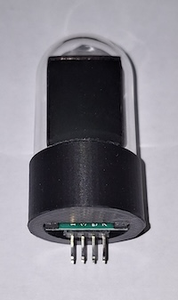
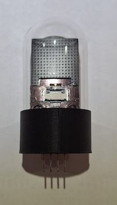
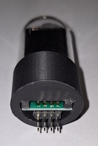

# Fake Nixie Clock
# This document is Work In Progress
Nixie style clock using ESP32 and ST7789 IPS LCD displays

# Main Components

- 1 off ESP32 38 pin version 
- 
  
- 4 off IPS 1.14 inch TFT LCD IPS display 8 pin Direct Insertion version (not the 13 pin version).  Additonal pictures show basic LCD assembly as well as what a full fake nixie tube could look like with the 3D printed components and glass domes
-  

- 4 off LCD Adapter boards - FPC FFC Cable 8 PIN 0.5mm pitch Connector to 2x4 pin 2.54 mm pitch through hole DIP PCB.  Image of these PCBs is provided below under PCBs
  
- 4 off 2x4 right angle male header pins
- 

# PCBs

The pcbs makes for a tidy build although you can make point to point connections on prototype boards
- 1 off Display PCB 
- 1 off ESP32 Controller PCB (This PCB also allows for the addition of buttons and a buzzer.  All the ESP32 pins are broken out as well for any further user development)
- LCD Adapter PCBs (4 off - 1 for each display)
 
- 

# Optional Components

- 4 off 2x4 female header sockets (2,54mm pitch)
  
- 2 off 1x10 male header pins (2,54mm pitch)
  
- 10 off dupont female to female wires (these can come purchase as a ribbon of cables)
  
- 1 off micro USB PSU

All components available from Aliexpress, Ebay and electronic stockists

- 1 off Enclosure to suit
- 

- 4 off Glass domes for the nixie effect - 38mm High x 25mm Diameter
- 

- 4 off 3D printed base to suit glass dome
-

- 4 off 3D printed LCD/Adpater mount
-

# LCD Assembly

The 2x4 Male Header Pins need to be soldered onto the LCD PCB Adapter boards.  Please study the image below carefully and ensure the pins are soldered on the correct side of the PCB.  If you solder them to the wrong side, the pinouts will not be in line with the Schematics or the Display PCB.

- 

In its basic form, the LCD can then be bonded to the PCB as pictured below.

-  

However, if you would like the "full" Fake Nixie look;
- the LCD is bonded to the front of the LCD Mount (STL Provided).
- The LCD flexi circuit is then inserted into the PCB
- The PCB is bonded to the back of the 3D Printed LCD Mount
- The completed LCD Mount is then bonded into the 3D printed Base (STL Provided)
- Images from left to right; Front, Rear, Bottom

-   

# Display PCB assembly

If you have chosen to PCBs, assembly of this board is as follows;

- Solder 4 off 2x4 female headers onto the top of the board (solder on the underside of the board).  Make sure they are soldered straight.  I taped a straight edge to the board to ensure all the headers were aligned straight.

- Solder the 1 off 1x10 male header onto the underside of the board (i.e. solder the top of the board).

- The front of the board has 4 large holes for mounting the board in an enclosure.  My original design used Hex Cap Bolts that sat on top of the enclosure and the PCB was bolted to these.  The original 3D printed bases were held in place by sitting on top of these Cap heads that sat on top of the enclosure.

# Clock Controller PCB assembly

If you have chosed to use PCBs, assembly of this board is very straight forward.

- Solder 2 off 1x19 Female headers to the top of the board
- Solder 1 off 1x10 male header to to top of the board

# Connecting the Boards

- The 2 PCBs can be connected using 1x10 female to female dupont connecting wires (I used 10cm wires)
- The pinouts are the same on both boards so the wiring is 1 to 1.

# Clock Controller using Prototype Boards

I strongly recommend getting the PCBs manufacture (all files provided and can be ordered through JLCPCB).  I developed the initial design with prototype breadboard.   Using an ESP32 and a single display, I proved the concept and then I added a second display.  It was at this point I decided to design the Display PCB (to reduce the number of connections to the ESP32 from 32 to 10) and the Clock Controller PCB to make everything look more tidy.

- If you wish to setup on prototype breadboard, please follow the schematics very carefully.  

- If you use this approach I strongly recommend that you setup the system for 1 display until it is working.  You can then add additional displays as per the Schematic.  You will quickly find that the volume of wires makes for a very untidy looking setup.
  - 
     
# ESP32 Programming

There is much more room for errors from this point forward as every PC/Mac/Linux setup will be slightly different to the setup used for this project.  Descriptions of the steps taken are provided but you may need to some some research if the instructions here do not lead to the desired outcome.

- If you haven't already, install the Arduino IDE onto your PC/Laptop.  I used Arduino IDE 2.3.x but I beleive the following will also work on Arduino IDE 1.8.x
  
- Install the following Libraries (version numbers provided in case there are any incompatibility issues with any later versions)
  - SPI.h
  - TFT_eSPI.h by Bodmer (version 2.5.43)
  - Time.h by Michael Margolis (version 1.6.1)
  - WiFi.h by Arduino (version 1.2.7)

- Download and open the project files (Fake_Nixie_Tutorial_1) into the IDE.
  - There should be four tabs as follows (if not copy them into the project)
    - Fake_Nixie_Tutorial_1.ino - The main code
    - nixieFont.h - The font data for Nixie style numbers
    - nixieClockConfig.h - Wifi and daylight saving configuration information
    - example_User_Setup_file_for_TFT_eSPI_h - instructions for modify the user file that is necessary to make the LCD displays work with the ESP32.

- Make the modifications to the TFT_eSPI.h User_Setup file as detailed in the "example_User_Setup_file_for_TFT_eSPI_h"
- Click on the "nixieClockConfig.h" tab and Modify the WiFi credentials and the Daylight Saving code as described.  All text must be between quotation marks  e.g. "WiFiSSID_5G"

- Make sure you have installed the ESP32 boards (search online on how to do this if you haven't done this)

- Select the board type of "ESP32 Dev Module".  There are many ESP32 boards available but this one works for the 38pin ESP32 Wroom 32 

- Select the partition scheme of "Minial SPIFFS (1.9MB App with OTA/190KB SPIFFS)".  If you do not do this, the compiled program will not fit into the default space available on the ESP32 device.

- Click compile and everything should compile properly.

- Connect your ESP32 using the appropriate USB Cable and ensure that it is recognised by your PC/Laptop.
  - If you have problems getting your setup to recognise your ESP32 device you should check;
    - The ESP32 power LED is illuminated
    - You have a USB cable that carries data not just power
    - It is visible in your setups device manager

- Once the IDE can "see" your ESP32, and assuming the programme compiled correctly you can now compile and program the device.
  - You may need to press the "Boot" button on your ESP32 if the IDE is unable to connect and program the device.

 

# Disclaimer

No warranties or guarantees are provided or inferred for the use of any of the files or information provided in this reposititory.
Google and ChatGPT are your freinds if you encounter any problems
