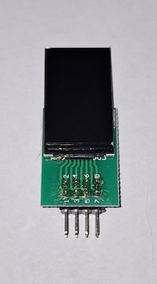
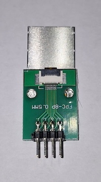

# Fake Nixie Clock
# This document is Work In Progress
Nixie style clock using ESP32 and ST7789 IPS LCD displays

# Main Components

- 1 off ESP32 38 pin version 
- 
  
- 4 off IPS 1.14 inch TFT LCD IPS display 8 pin Direct Insertion version (not the 13 pin version).  Additonal pictures show basic LCD assembly as well as what a full fake nixie tube could look like with the 3D printed components and glass domes
-  

- 4 off LCD Adapter boards - FPC FFC Cable 8 PIN 0.5mm pitch Connector to 2x4 pin 2.54 mm pitch through hole DIP PCB.  Image of these PCBs is provided below under PCBs
  
- 4 off 2x4 right angle male header pins
- 

# PCBs

The pcbs makes for a tidy build although you can make point to point connections on prototype boards
- 1 off Display PCB 
- 1 off ESP32 Controller PCB (This PCB also allows for the addition of buttons and a buzzer.  All the ESP32 pins are broken out as well for any further user development)
- LCD Adapter PCBs (4 off - 1 for each display)
 
- 

# Optional Components

- 4 off 2x4 female header sockets (2,54mm pitch)
  
- 2 off 1x10 male header pins (2,54mm pitch)
  
- 10 off dupont female to female wires (these can come purchase as a ribbon of cables)
  
- 1 off micro USB PSU

All components available from Aliexpress, Ebay and electronic stockists

- 1 off Enclosure to suit
- 

- 4 off Glass domes for the nixie effect - 38mm High x 25mm Diameter
- 

- 4 off 3D printed base to suit glass dome
-

- 4 off 3D printed LCD/Adpater mount
-

# LCD Assembly

The 2x4 Male Header Pins need to be soldered onto the LCD PCB Adapter boards.  Please study the image below carefully and ensure the pins are soldered on the correct side of the PCB.  If you solder them to the wrong side, the pinouts will not be in line with the Schematics or the Display PCB.

- 

In its basic form, the LCD can then be bonded to the PCB as pictured below.

-  

However, if you would like the "full" Fake Nixie look;
- the LCD is bonded to the front of the LCD Mount (STL Provided).
- The LCD flexi circuit is then inserted into the PCB.
- The PCB is bonded to the back of the 3D Printed LCD Mount.
- The completed LCD Mount is then bonded into the 3D printed Base

- 

# ESP32 Programming
Place holder for ESP32 programming

# Disclaimer

No warranties or guarantees are provided or inferred for the use of any of the files or information provided in this reposititory.
Google and ChatGPT are your freinds if you encounter any problems
